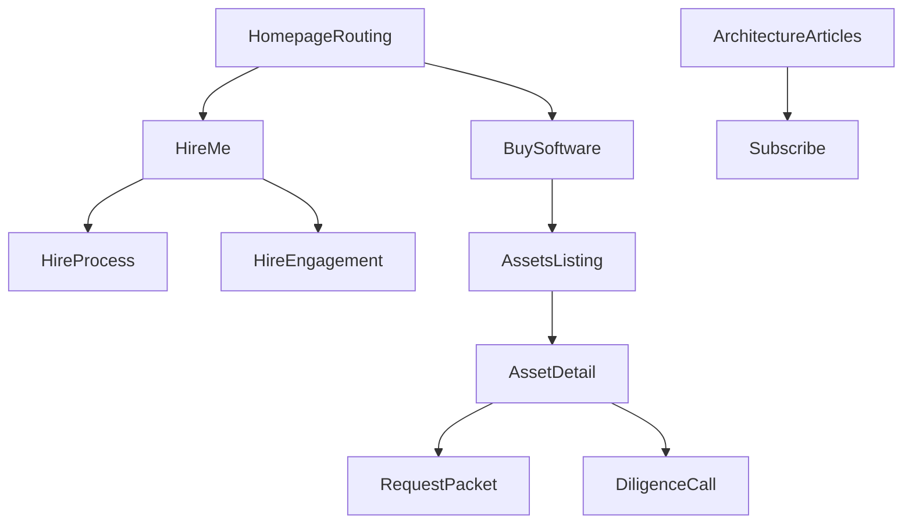

# Dual-Offering Studio Website Blueprint

## Non-negotiable principles (to prevent overlap)

- **Two businesses, one brand, zero blending**: every page belongs to exactly one lane: **Services (Systems Studio)** or **Assets (Software Assets)**. No “we can also…” paragraphs.
- **Homepage is only routing**: no portfolio grid, no generic agency hero, no “full-stack partner” language.
- **Two distinct CTAs everywhere**:
  - Services lane CTA language: **“Scope a system”**, **“Book a technical fit call”**, **“Request a build plan”**.
  - Assets lane CTA language: **“Request acquisition packet”**, **“Start diligence”**, **“Make an offer”**, **“License this asset”**.
- **Visual separation**: consistent but distinct patterns per lane (iconography, layout rhythm, accent color, card shape, microcopy). Same typography system; different “mode.”
- **Hard routing in navigation**: top-level nav items map 1:1 to lanes.
- **Content governance**: each page has a “Lane header” and a “Not for you?” link that routes without explaining the other lane.

## Primary navigation (required)

- **Hire Me** (Services lane)
- **Buy Software** (Assets lane)
- **Architecture Articles** (Authority lane; educational only)

Secondary utility (top-right or footer)

- About
- Process
- Pricing/Engagement (services)
- FAQ (separate FAQs per lane)
- Contact
- Newsletter/RSS (articles)

## Global IA and routing mechanics

### Lane indicator

- A persistent, subtle label in header after routing:
  - Services: “Systems Studio”
  - Assets: “Software Assets”
- Clicking the label opens a small “Switch lane” panel with two options; **no explanatory copy** beyond a one-sentence definition.

### Route guardrails

- Services pages never mention “buy,” “acquire,” “license,” “assets.”
- Assets pages never mention “engagement,” “retainer,” “we build,” “custom.”
- Articles never include sales CTAs; only **subscribe** and **read next**.

### Conversion objects (what users can do)

- **Services conversions**:
  - Primary: book a call
  - Secondary: submit system brief (form)
  - Tertiary: download 1-pager “Systems Studio: how we work”
- **Assets conversions**:
  - Primary: request acquisition packet (gated)
  - Secondary: schedule diligence call
  - Tertiary: sign NDA (if required) / request demo access

## Homepage (Routing Layer) — `/`

### Purpose

Instantly route visitors to the correct lane within 5–10 seconds.

### Primary user intents

- “I need a team to design/build a system.”
- “I want to buy/license software that already exists.”

### Conversion goal

A **single click** into the right lane.

### Copy direction (strict)

- No positioning claims like “end-to-end partner.”
- Use plain technical definitions.

### Recommended hero content

- Headline: **“Two ways to work with us.”**
- Subhead: **“Hire the Systems Studio for bespoke software systems. Buy Software Assets when you want ownership or licensing rights to a finished product.”**

### Two-path chooser (above the fold)

- Two large option panels (equal weight), each with:
  - Title
  - 1-sentence definition
  - 3 bullets “You are here if…”
  - Primary CTA button

**Panel A — Hire Me (Systems Studio)**

- Definition: “We design and build tailored internal or customer-facing systems for your company.”
- “You are here if…” bullets:
  - “You have a workflow or product constraint that needs custom software.”
  - “You need architecture + implementation, not a template.”
  - “You want a senior team to collaborate with your engineers and stakeholders.”
- CTA: **“Hire the Systems Studio”** → `/hire`

**Panel B — Buy Software (Assets)**

- Definition: “We sell turnkey software products with transfer-ready code, docs, and operating playbooks.”
- “You are here if…” bullets:
  - “You want to acquire an operational software asset.”
  - “You can operate, market, and support a product.”
  - “You want ownership or licensing terms, not a dev engagement.”
- CTA: **“Browse Software Assets”** → `/buy`

### Below the fold (keep minimal)

- A short “How to choose” decision checklist (5–7 items) with a **binary** answer leading to one lane.
- A trust strip (logos/counts) allowed, but **no case study thumbnails**.
- Footer with site nav.

### UI layout behavior

- Mobile: panels become stacked, each still full height-ish with one primary CTA.
- Sticky header appears only after first scroll; includes the three nav items.

## Hire Me (Systems Studio) section

### Landing page — `/hire`

#### Purpose

Explain bespoke engineering engagements: what you build, how you work, outcomes, engagement structure.

#### Primary user intents

- Validate fit (type of system, team, process)
- Reduce risk (how you plan, deliver, communicate)
- Understand next steps and typical engagement model

#### Conversion goal

Book a technical fit call or submit system brief.

#### Page structure (recommended)

1. **Header: “Systems Studio”** + one-line definition.
2. **What we build** (system categories; no product language)
  - Internal tooling (ops, finance, compliance)
  - Customer-facing portals (accounts, onboarding)
  - Data pipelines + reporting
  - AI-enabled workflows (with guardrails, evaluation)
  - Integrations (CRM/ERP/payment/auth)
3. **Outcomes** (measurable, practical)
  - “Reduce cycle time from X to Y”
  - “Replace spreadsheet/process debt with audited workflows”
  - “Increase reliability / reduce incident load”
4. **How we work (collaboration-first)**
  - Discovery → Architecture → Build → Hardening → Handoff
  - Explicit stakeholder cadence, RFCs, design reviews
5. **Engagement structure**
  - “Fixed-scope build” vs “Monthly systems partner” (choose one as default; mention the other as alternative only if necessary)
  - Team composition, communication channels, working agreements
6. **Why not a freelancer/agency** (technical + risk framing)
  - “Senior architecture decisions, not ticket throughput”
  - “Ownership-quality code, not campaign code”
  - “Production hardening: monitoring, migrations, security posture”
7. **Fit constraints** (who you’re not for)
  - “If you need staff augmentation”
  - “If you want a feature factory with minimal discovery”
8. **CTA block**
  - Primary: “Book a technical fit call”
  - Secondary: “Send a system brief”

#### UI behavior

- Left-side sticky “Engagement summary” card on desktop: timeline, typical budget bands (optional), primary CTA.
- Inline “Evidence chips” (latency, uptime, adoption, revenue impact) that jump to an on-page **Outcomes** section (or open a small outcomes drawer), without routing to a separate case studies area.

### How it works — `/hire/process`

- Purpose: de-risk delivery; make the process concrete.
- Includes:
  - Discovery outputs: system map, risk register, success metrics
  - Architecture outputs: ADRs, data model, event flows
  - Build outputs: staging, CI/CD, observability
  - Handoff outputs: runbooks, ownership transfer, training
- CTA: “Book fit call”

### Engagement models — `/hire/engagement`

- Purpose: remove ambiguity around structure.
- Content:
  - Model A: Fixed-scope build (milestones, acceptance criteria)
  - Model B: Retained systems partner (capacity, backlog, governance)
  - What’s included / not included
- CTA: “Request a build plan” (form)

### Services FAQ — `/hire/faq`

- Purpose: handle objections (security, IP, timelines, stacks).
- Strictly service-related.

### Contact for services — `/hire/contact`

- Short form: problem statement, system context, users, constraints, timeline.
- Optional file upload for existing docs.

## Buy Software (Software Assets) section

### Marketplace landing — `/buy`

#### Purpose

Present a marketplace-like listing of available software assets.

#### Primary user intents

- Browse inventory
- Evaluate fit and business model
- Start diligence

#### Conversion goal

Request acquisition packet for a specific asset.

#### Page structure

1. Header: “Software Assets” + definition.
2. **Inventory grid** (cards) with consistent fields:
  - Asset name
  - Category
  - Operating mode: “owner-operated” / “team-operated”
  - Monetization type: subscription, usage-based, lead-gen, internal efficiency
  - Status: “for sale” / “licensed” / “in diligence”
3. Filters:
  - Category, target customer, complexity, revenue model, compliance sensitivity
4. “How acquisition works” (3–5 steps; no services language)
  - Packet → Diligence → Terms → Transfer → Support window

#### UI behavior

- Cards click to product detail pages.
- Sticky filter bar on scroll.

### Product detail template — `/buy/[asset-slug]`

#### Purpose

Make each asset feel like a digital business asset listing; enable informed inquiry.

#### Primary user intent

Determine: “Can I operate this, and what do I get?”

#### Conversion goal

Request acquisition packet, schedule diligence call.

#### Required sections

1. **Asset overview**
  - What it does (1 paragraph)
  - Who should operate it (role + capability requirements)
2. **Value mechanism** (how it generates value/revenue)
  - Demand channel assumptions
  - Pricing model examples
  - Unit economics placeholders if available
3. **What you receive** (deliverables list)
  - Source code repo(s)
  - Infra/IaC (if included)
  - CI/CD config
  - Documentation + runbooks
  - Operating playbook (growth + support)
  - Backlog and known issues
4. **Transfer process**
  - Timeline
  - Access migration (domains, email, cloud accounts)
  - Credential rotation + security handoff
5. **Support period**
  - Included support window and boundaries
  - Optional paid extension (if allowed)
6. **Ownership / licensing terms**
  - Acquisition: full IP assignment
  - Licensing: scope, term, exclusivity, sublicensing rules
7. **Risk & constraints** (be explicit)
  - Dependencies, vendor lock-in, compliance notes
8. **Diligence CTA**
  - Primary: “Request acquisition packet”
  - Secondary: “Schedule diligence call”

#### UI layout behavior

- Above fold: left = summary, right = “Acquisition snapshot” sticky card with:
  - Price (or “priced on request”)
  - Asset type
  - Tech stack
  - Operator profile
  - CTA
- Tabs or anchored sections; keep scannable.

### Assets FAQ — `/buy/faq`

- Topics: NDAs, escrow, verification, transfer, licensing definitions.

### Acquisition intake — `/buy/contact`

- Form fields: intended operation, timeframe, budget range, licensing vs acquisition preference, diligence readiness.

## Architecture Articles — `/articles`

### Purpose

Establish authority in system design, AI implementation, and production engineering.

### Rule

**No sales copy.** No service/product CTAs.

### Listing behavior

- Categories: System design, AI in production, Reliability, Data, Security
- Read-time, publish date, difficulty level
- Subscribe (email) + RSS

### Article template — `/articles/[slug]`

- Strong technical opening (problem framing)
- Diagrams (sequence/flow) when helpful
- Code snippets allowed
- “Practical checklist” section
- End: “Subscribe” + “Next article” only

## About — `/about` (optional but recommended)

### Purpose

Explain the unifying brand identity without blending offers.

### Structure

- Brand thesis: “We build and operate software with ownership-level rigor.”
- Two business lines (two clean cards with one sentence each) linking to `/hire` and `/buy`.
- Team/operator ethos, technical standards.

## Design system: lane separation without rebranding

### Shared

- Typography, grid, spacing, component library, dark/light mode.

### Services lane (Systems Studio)

- Visual language: diagrams, architecture blocks, process steps.
- Component emphasis: timelines, collaboration artifacts, system maps.

### Assets lane (Software Assets)

- Visual language: listing cards, spec sheets, acquisition snapshot.
- Component emphasis: filters, comparison, diligence checklist.

## Psychological positioning (clarity within seconds)

- **Identity-based routing**: “I am hiring builders” vs “I am buying an asset.”
- **Risk reversal through specificity**:
  - Services: process artifacts, governance, measurable outcomes.
  - Assets: transfer mechanics, deliverables, operator readiness, terms.
- **No blended credibility**: proof is isolated:
  - Systems proof lives inside the Services lane as **Outcomes** and **mini implementation briefs** (short, metric-forward, non-promotional, no separate “case studies” hub).
  - Asset proof lives on asset pages (usage, retention, ops notes) without referencing services.

## Conversion paths (end-to-end)

### Path A: Services (Hire Me)

1. Homepage → `/hire`
2. Validate fit → read process/engagement
3. Review outcomes + implementation briefs embedded on `/hire` (or an optional `/hire/outcomes` page if needed, not in main nav)
4. Convert → book call or submit system brief

### Path B: Assets (Buy Software)

1. Homepage → `/buy`
2. Filter inventory → view asset page
3. Request acquisition packet
4. Diligence call → terms → transfer

### Mermaid: routing map

## Content production plan (what needs to be written)

- Homepage routing copy (tight, binary)
- Services pages:
  - `/hire` core narrative
  - `/hire/process` detailed deliverables
  - `/hire/engagement` terms + structure
  - `/hire/faq` objections
  - 5–8 outcomes/mini-brief blocks embedded in `/hire` (anonymized OK)
- Assets pages:
  - `/buy` listing intro + acquisition steps
  - Product template content blocks + diligence packet template
  - `/buy/faq` and `/buy/contact`
- 12–20 architecture articles (AI-generated, edited for correctness)

## Implementation notes for designers/developers

- Treat “lane” as a site-wide state derived from current route.
- Use two component variants for shared primitives (cards, CTA buttons).
- Ensure internal links don’t cross lanes except via “Switch lane” control.
- Analytics events:
  - `home_route_hire`, `home_route_buy`
  - `hire_cta_book_call`, `hire_submit_brief`
  - `buy_request_packet`, `buy_schedule_diligence`
  - `article_subscribe`

## Acceptance criteria (what “zero confusion” looks like)

- On homepage, users can answer “Which path is for me?” without scrolling.
- No page contains mixed-lane verbs (hire/build vs buy/acquire/license).
- Services proof lives inside the Services lane (outcomes/mini-briefs) and never routes into an assets browsing flow.
- Articles build authority without any sales pitch.

